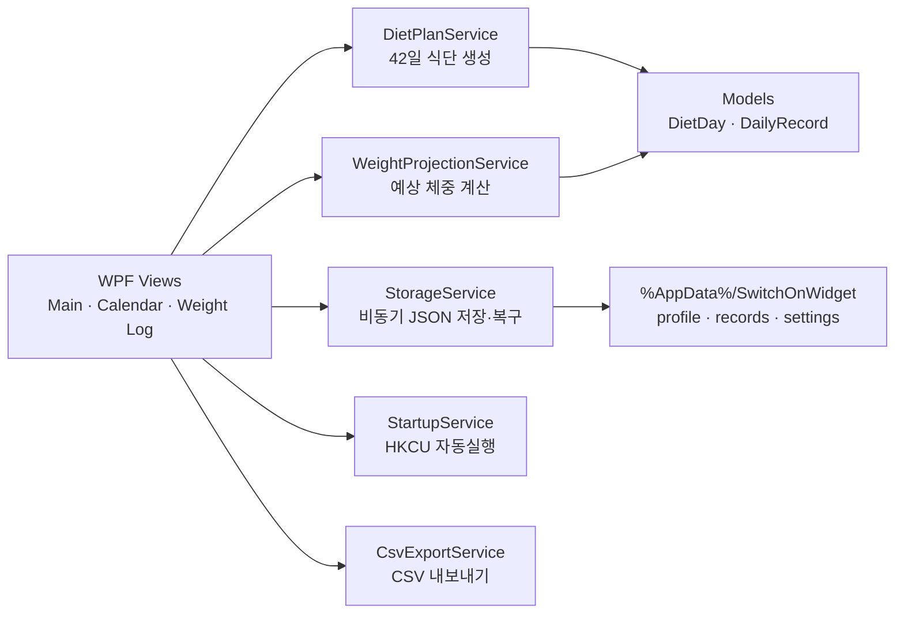

<div align="center">


# SwitchOnWidget

**오프라인 우선으로 설계한 .NET 8 WPF 기반 6주 식단·체중 관리 데스크톱 위젯**

[](https://github.com/SONOFSEA/SwitchOnWidget/actions/workflows/build.yml)


[](LICENSE)

</div>

Edge 앱 모드, 브라우저, Electron 없이 Windows에서 독립 실행되는 네이티브 데스크톱 애플리케이션입니다. 2026-06-22부터 2026-08-02까지 42일의 식단 수행률과 체중 변화를 인터넷 연결 없이 기록합니다.

## 프로젝트 한눈에 보기

| 구분 | 내용 |
|---|---|
| 개발 목적 | 반복 가능한 식단 계획과 실제 수행 기록을 작은 데스크톱 위젯으로 통합 |
| 기술 스택 | C# 12, .NET 8, WPF, System.Text.Json, Windows Registry |
| 아키텍처 | UI · Models · Services를 분리한 계층형 구조 |
| 데이터 | `%AppData%\SwitchOnWidget`의 로컬 JSON, 임시 파일 기반 안전 저장 |
| 핵심 품질 | `DateOnly` 날짜 안정성, JSON 손상 복구, 단일 인스턴스, 비동기 I/O |
| 외부 의존성 | 없음 — 외부 NuGet 패키지 및 네트워크 불필요 |

### 해결한 문제

- 웹 버전의 UTC 변환 때문에 한국 날짜가 하루 밀리던 문제를 `DateOnly` 중심 설계로 제거했습니다.
- 단순 체크리스트를 넘어 42일 계획, 예외 일정, 실제 기록, 체중 예상선을 하나의 로컬 앱으로 통합했습니다.
- 저장 중 앱이 종료되거나 JSON이 손상되어도 데이터를 복구할 수 있도록 임시 파일 교체와 손상 파일 백업을 적용했습니다.
- WPF 기본 기능만으로 트레이 앱, 자동실행, Canvas 선 그래프를 구현해 배포 의존성을 최소화했습니다.

> 79kg에서 68kg까지 6주 감량은 매우 공격적인 목표입니다. 앱은 보수·표준·도전 예상선을 비교용으로 제공하며, 건강 상태에 맞는 목표와 식단은 의료·영양 전문가와 상의하세요.

## 주요 기능

- 420×640 크기의 다크 모드 위젯과 드래그 이동
- 항상 위 옵션, 최소화/닫기 시 시스템 트레이 숨김, 트레이에서 다시 열기
- 날짜별 반복 식단과 밥 약속·술약속·회복식 자동 보정
- 6가지 일일 체크 상태 변경 즉시 저장
- 30~200kg 범위의 실제 체중과 메모 기록
- 보수·표준·68kg 도전 예상선과 실제 체중 Canvas 그래프
- 42일 캘린더, 날짜별 상세 기록 편집, 완료율 색상 배지
- 최근 7개 체중 기록 평균과 시작 체중 대비 변화량
- UTF-8 BOM CSV 내보내기
- 관리자 권한 없는 Windows 자동실행 등록/해제
- 손상된 JSON 자동 백업 및 기본값 복구
- 단일 인스턴스 실행과 완전 종료

## 시스템 구조



상세 설계와 데이터 흐름은 [아키텍처 문서](docs/ARCHITECTURE.md)에 정리했습니다.

## 필요한 환경

- Windows 10 또는 Windows 11
- [.NET 8 SDK](https://dotnet.microsoft.com/download/dotnet/8.0)

외부 NuGet 패키지나 인터넷 연결은 필요하지 않습니다.

## 빠른 시작

```powershell
git clone https://github.com/SONOFSEA/SwitchOnWidget.git
cd SwitchOnWidget
dotnet run --project SwitchOnWidget
```

## 빌드와 실행

PowerShell에서 이 README가 있는 폴더로 이동한 뒤 실행합니다.

```powershell
dotnet restore
dotnet build
dotnet run --project SwitchOnWidget
```

또는 솔루션을 직접 지정할 수 있습니다.

```powershell
dotnet build .\SwitchOnWidget.sln
```

## 배포용 단일 exe 만들기

Windows x64용 self-contained 빌드:

```powershell
dotnet publish .\SwitchOnWidget\SwitchOnWidget.csproj -c Release -r win-x64 --self-contained true /p:PublishSingleFile=true /p:IncludeNativeLibrariesForSelfExtract=true
```

결과 파일은 기본적으로 다음 폴더에 생성됩니다.

```text
SwitchOnWidget\bin\Release\net8.0-windows\win-x64\publish\
```

다른 PC에는 `publish` 폴더의 결과물을 복사해 실행합니다. self-contained 배포이므로 대상 PC에 .NET 런타임을 별도로 설치할 필요가 없습니다.

## 자동실행 등록과 해제

메인 위젯 하단의 버튼을 사용합니다.

- `자동실행 등록`: 현재 사용자 레지스트리의 `HKCU\Software\Microsoft\Windows\CurrentVersion\Run`에 `SwitchOnWidget` 실행 명령을 등록합니다.
- `자동실행 해제`: 위 값을 제거하여 다음 Windows 로그인부터 자동으로 실행되지 않게 합니다.

HKCU만 사용하므로 관리자 권한이 필요하지 않습니다. 배포 위치를 옮긴 경우 기존 자동실행을 해제한 다음 새 위치에서 다시 등록하세요. 개발 중 `dotnet run`으로 실행한 경우에는 `dotnet.exe`와 앱 DLL 경로를 함께 등록합니다.

## 정지와 자동실행 해제의 차이

- `정지 · 완전히 종료`: 현재 입력과 설정을 저장하고 트레이 아이콘을 제거한 뒤 현재 프로세스를 완전히 종료합니다. 자동실행 등록 상태는 바꾸지 않습니다.
- `자동실행 해제`: 다음 로그인 때 앱이 시작되지 않도록 등록만 제거하며, 현재 실행 중인 앱은 종료하지 않습니다.

일반 창 닫기나 최소화는 앱을 종료하지 않고 시스템 트레이로 숨깁니다.

## 로컬 데이터 저장

모든 데이터는 다음 폴더에 JSON으로 저장됩니다.

```text
%AppData%\SwitchOnWidget\
├─ profile.json
├─ records.json
└─ settings.json
```

- `profile.json`: 시작 체중, 신체 정보, 목표 체중, 시작일
- `records.json`: 날짜별 체크 상태, 실제 체중, 메모
- `settings.json`: 자동실행 표시 상태, 창 위치, 항상 위 옵션, 마지막 실행 날짜

파일이 없으면 기본값을 자동 생성합니다. JSON 구문이 깨진 파일은 같은 폴더에 `.corrupt-날짜시간` 접미사로 백업하고 기본값으로 복구합니다. 저장 시 먼저 `.tmp` 파일을 완성한 뒤 원본과 교체하여 중간 쓰기로 인한 손상을 줄였습니다.

## 날짜가 하루 밀리지 않는 방식

계획 날짜와 기록 키는 모두 C# `DateOnly`를 사용합니다.

- 시작일을 `new DateOnly(2026, 6, 22)`로 고정
- Day 번호는 두 `DateOnly.DayNumber`의 차이로 계산
- 오늘은 `DateOnly.FromDateTime(DateTime.Now)`로 Windows 로컬 날짜에서 얻음
- 날짜를 UTC로 변환하거나 ISO 문자열을 `DateTime`으로 왕복하지 않음
- JSON에도 `DateOnly` 값을 `yyyy-MM-dd` 형태로 직접 직렬화

따라서 JavaScript의 `toISOString()`과 같은 UTC 변환 때문에 Asia/Seoul 날짜가 전날로 바뀌는 경로가 없습니다. 42일 범위는 Day 1 `2026-06-22`부터 Day 42 `2026-08-02`까지 정확히 생성됩니다. 시작 전인 `2026-06-20` 일정은 생성 대상에 포함되지 않습니다.

## 예상 체중 계산

Day 1의 79.0kg과 Day 42의 각 목표값 사이를 41개 간격으로 선형 보간하고 소수점 첫째 자리로 반올림합니다.

- 보수 감량선: Day 42에 74.0kg
- 표준 예상선: Day 42에 71.5kg
- 도전선: Day 42에 68.0kg

예상선은 계획 비교용이며 실제 체중은 별도의 날짜별 값으로 저장됩니다.

## 주요 파일

```text
SwitchOnWidget.sln
SwitchOnWidget/
├─ App.xaml / App.xaml.cs                 앱 리소스, 단일 인스턴스, 전역 예외 처리
├─ MainWindow.xaml / MainWindow.xaml.cs   위젯, 트레이, 저장, 종료, 자동실행 UI
├─ Models/
│  ├─ DietDay.cs                          날짜별 식단 모델
│  ├─ DailyRecord.cs                      체크·체중·메모 기록
│  ├─ UserProfile.cs                      사용자와 목표 기본값
│  └─ AppSettings.cs                      창과 실행 설정
├─ Services/
│  ├─ DietPlanService.cs                  DateOnly 기반 42일 식단 생성
│  ├─ StorageService.cs                   JSON 초기화·복구·원자적 저장
│  ├─ StartupService.cs                   HKCU Run 등록/해제
│  ├─ WeightProjectionService.cs          3개 예상 체중선 계산
│  └─ CsvExportService.cs                 CSV 생성
├─ Views/
│  ├─ CalendarWindow.xaml(.cs)            42일 캘린더와 날짜별 편집
│  └─ WeightLogWindow.xaml(.cs)           체중 목록·통계·Canvas 그래프·CSV
└─ Assets/
   ├─ app.ico                             실행 파일·트레이 아이콘
   └─ generate-app-icon.ps1               아이콘 재생성 스크립트
```

아이콘을 다시 생성하려면 다음 명령을 사용합니다.

```powershell
powershell -NoProfile -ExecutionPolicy Bypass -File .\SwitchOnWidget\Assets\generate-app-icon.ps1
```

## 검증

GitHub Actions의 Windows 환경에서 다음 항목을 자동 검증합니다.

```powershell
dotnet restore .\SwitchOnWidget.sln
dotnet build .\SwitchOnWidget.sln -c Release --no-restore
```

로컬 최종 검증 결과: **경고 0개, 오류 0개**.

## 라이선스

이 프로젝트는 [MIT License](LICENSE)로 공개됩니다.
